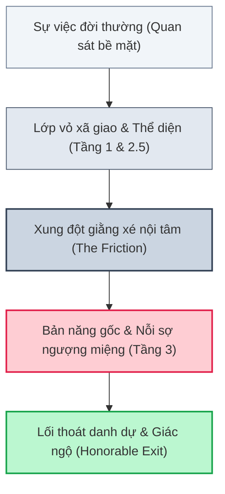
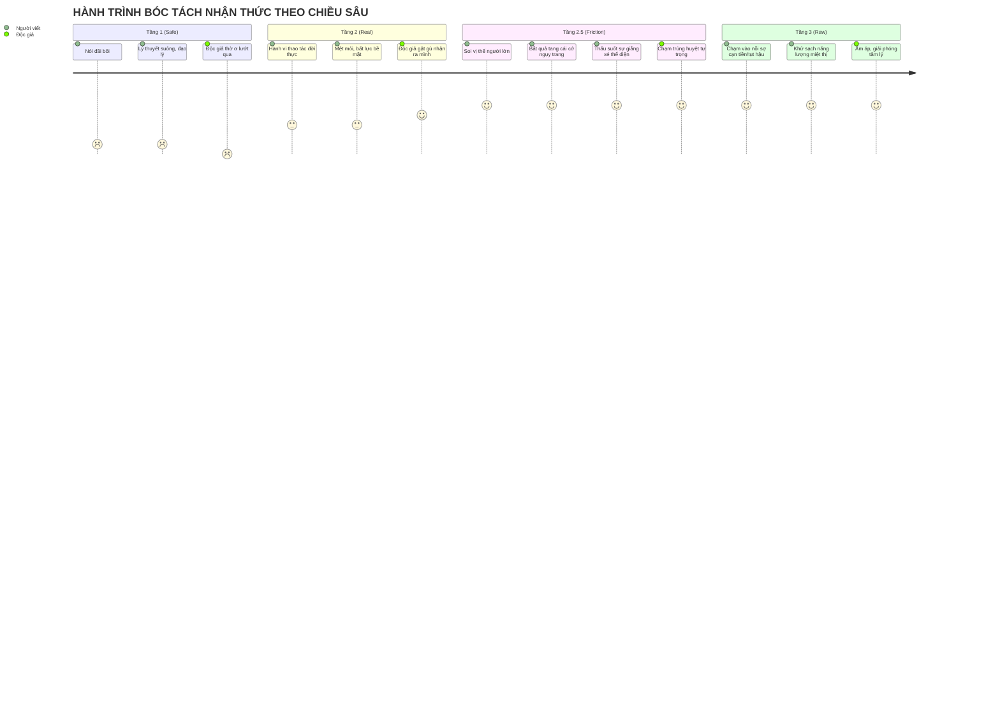
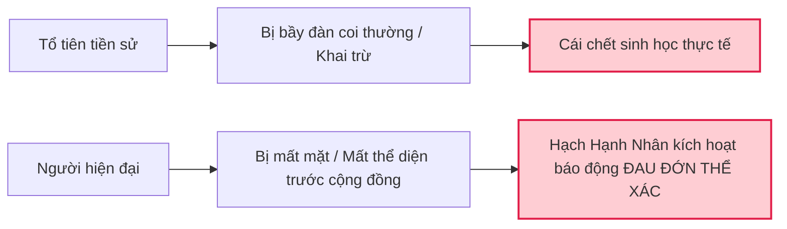
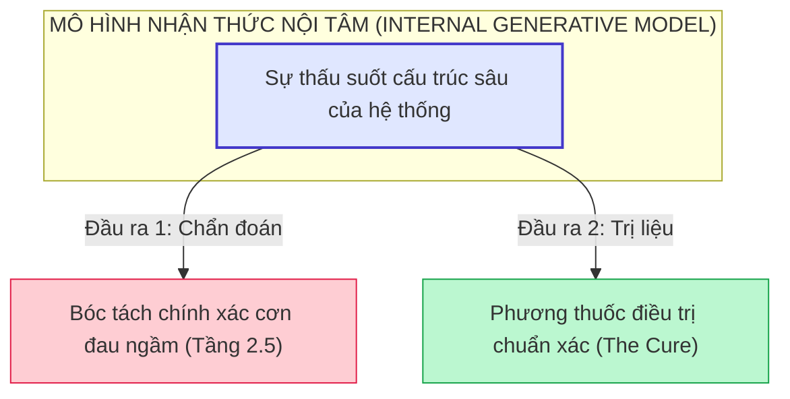
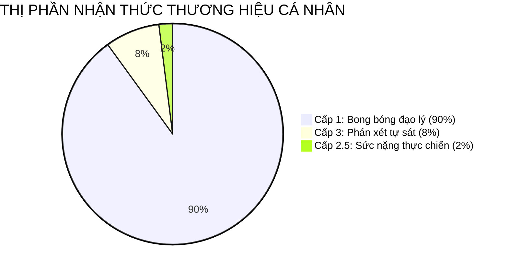
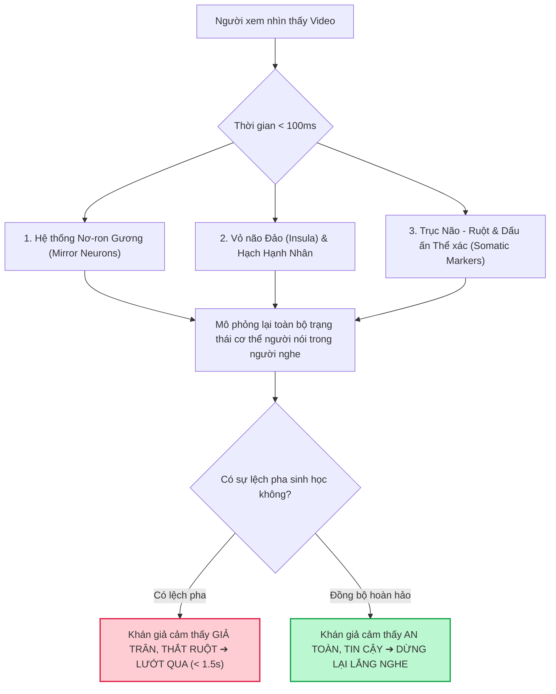
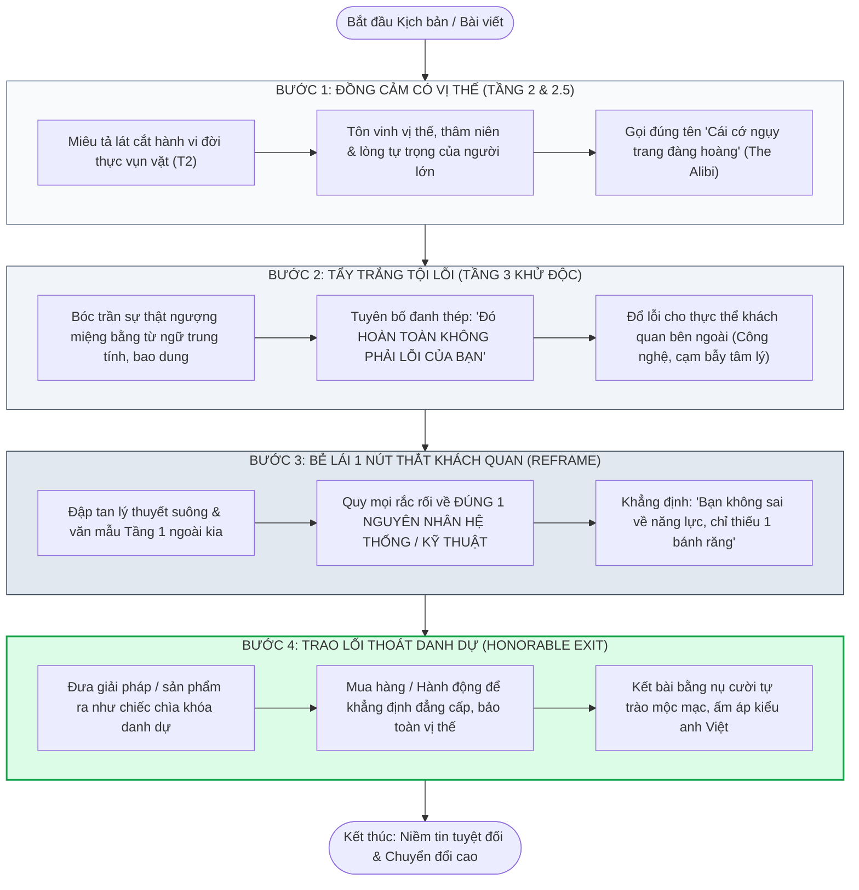

# BÁO CÁO NGHIÊN CỨU ĐẶC BIỆT (WHITE PAPER)
# HỆ THỐNG KHUNG "3 TẦNG" NHẬN THỨC (1 ➔ 2 ➔ 2.5 ➔ 3) VÀ CHIẾN LƯỢC XÂY DỰNG THƯƠNG HIỆU CÁ NHÂN THỰC CHIẾN

**Chủ đề:** Khoa học Thần kinh, Tiến hóa Nhận thức, Thuyết Tín hiệu Đắt giá (*Costly Signaling*) & Cơ chế Quang học Giải phẫu trên Video Ngắn  
**Tác giả & Đóng gói:** Chuyên gia Nghiên cứu Chiến lược Nội dung, Khoa học Thần kinh & Tiến hóa Nhận thức  
**Hệ quy chiếu tư duy:** Chuẩn nhận thức thực chiến & văn phong mộc mạc của anh Việt (Vietmac Voice)  
**Tài liệu gốc tại máy:** [NGHIEN_CUU_HE_THONG_3_TANG_VA_THUONG_HIEU_CA_NHAN.md](file:///Users/vietmac/Documents/CODE/Video%20phan%20tich/NGHIEN_CUU_HE_THONG_3_TANG_VA_THUONG_HIEU_CA_NHAN.md)  

---

> [!IMPORTANT]
> **BẢN CHẤT CỐT LÕI CỦA CÔNG TRÌNH NGHIÊN CỨU:**  
> Tài liệu này được đúc kết từ toàn bộ chuỗi tranh luận học thuật và thực chiến đỉnh cao từ luồng chính [tang 2.5 bóc tách - 03](conversation://b1eeae7f-7c0c-4f14-a475-3a28756e5e3c), nhánh [ban cha 2.5](conversation://ff81d471-c218-4ffe-8236-1833f4484ead), cùng 2 nhánh giải phẫu chuyên sâu [subagent c13bee14](conversation://c13bee14-5c15-482a-b697-7551e12277d9) và [subagent efa7cef0](conversation://efa7cef0-6074-4a35-ac3e-94710e0e1c75).  
> Toàn bộ nội dung được giải phẫu từ cấp độ nơ-ron sinh học, hạch hạnh nhân (*Amygdala*), thuyết tiến hóa tín hiệu đắt giá (*Zahavi*), định lý điều khiển học (*Conant-Ashby*), đến sự vận hành quang học của ống kính video 4K và bộ khung kịch bản 4 bước thực chiến.

---

## MỞ ĐẦU: CUỘC KHỦNG HOẢNG NIỀM TIN VÀ SỰ BẾ TẮC CỦA CÁC CÔNG THỨC TRUYỀN THỐNG

Thị trường nội dung số và truyền thông hiện đại đang trải qua một cơn đại hồng thủy về sự bão hòa. Mỗi ngày, hàng trăm triệu video ngắn, bài viết, podcast và chiến dịch marketing được bơm vào không gian mạng. Trí tuệ nhân tạo (AI) ra đời khiến chi phí biên để sản xuất một văn bản nghe có vẻ trơn tru hoặc một kịch bản chuẩn cấu trúc giảm xuống bằng 0. 

Thế nhưng, một nghịch lý cay đắng đang diễn ra:
* Càng nhiều nội dung ra đời, người xem càng trở nên trơ lì và vô cảm.
* Càng nhiều lời khuyên thành công, đạo lý làm giàu được phát tán, độc giả càng hoài nghi và đề phòng.
* Hầu hết các khóa học dạy "Xây dựng thương hiệu cá nhân", "Kể chuyện bán hàng (Storytelling)", "Làm video triệu view" ngoài kia đang dẫn người học vào ngõ cụt: Hoặc biến họ thành những kẻ rao giảng đạo lý sáo rỗng trên bục giảng, hoặc biến họ thành những kẻ múa may hề hước rẻ tiền đánh đổi danh dự để lấy lượt xem ảo.

Bi kịch lớn nhất thuộc về **những người làm nghề thực chiến, những chuyên gia có thâm niên, những chủ doanh nghiệp có sản phẩm tốt**: Họ có chuyên môn thật, có đạo đức nghề nghiệp, nhưng khi bước lên không gian truyền thông, tiếng nói của họ hoàn toàn lọt thỏm. Họ nói thì không ai nghe, viết bài thì không ai đọc, quay video thì ngượng ngùng, lúng túng và không chuyển đổi được khách hàng.

Tài liệu này không phải là một tập hợp các mẹo vặt (*tips & tricks*) hay các công thức giật gân rẻ rúng. Đây là một **công trình nghiên cứu hệ thống hóa từ gốc rễ**, giải phẫu chính xác cơ chế sinh học thần kinh (*neuroscience*), tâm lý học tiến hóa (*evolutionary psychology*), lý thuyết điều khiển học (*cybernetics*) và quang học video để trả lời dứt khoát 3 câu hỏi cốt tử:
1. *Tại sao con người lại tin tưởng một người lạ qua màn hình điện thoại?*
2. *Cơ chế ngầm nào khiến một khách hàng có học thức, có tiền sẵn sàng móc ví mua hàng mà không cảm thấy mình bị chiếu dưới?*
3. *Làm thế nào để chuyển hóa toàn bộ trải nghiệm sống và vết sẹo nghề nghiệp thành một thứ thương hiệu cá nhân có sức nặng tuyệt đối, không thể sao chép và trường tồn cùng năm tháng?*

---

## CHƯƠNG 1: BẢN CHẤT CỦA STORYTELLING THỰC CHIẾN

### 1.1. Giải ảo những ngộ nhận sai lầm về Storytelling
Trong suốt nhiều thập kỷ, ngành quảng cáo và các trường phái dạy viết nội dung đã gieo rắc một định kiến sai lệch về thuật ngữ "Storytelling" (Kể chuyện). Đại đa số mọi người khi nghe đến storytelling đều hình dung về:
* **Sự bịa đặt hư cấu:** Cố gắng thêu dệt nên một câu chuyện cảm động, tạo ra những nhân vật tưởng tượng với những biến cố kịch tính không có thật.
* **Mô thức cổ tích:** Bắt đầu bằng *"Ngày xửa ngày xưa"*, dẫn dắt qua *"Hành trình của người hùng"* (*The Hero's Journey*), gặp phù thủy, vượt qua thử thách và trở về với kho báu.
* **Kỹ thuật giật gân, thao túng cảm xúc rẻ tiền:** Cố tình bóp nghẹt tuyến lệ của người xem bằng những bi kịch éo le, tạo drama gia đình, tạo xung đột nhân tạo nhằm câu kéo sự chú ý nhất thời.

Thực tế chứng minh: Đối với tệp độc giả trưởng thành, người có học thức, chủ doanh nghiệp hoặc người có tiền, những kỹ thuật storytelling hư cấu này chỉ tạo ra sự phòng thủ và khinh miệt. Khi một người trưởng thành ngửi thấy mùi "kịch bản dàn dựng", toàn bộ hệ thống cảnh giác sinh học của họ lập tức dựng khiên. Họ nhận ra mình đang bị dẫn dắt bởi một kẻ bán hàng ma mãnh và ngắt kết nối ngay lập tức.

### 1.2. Storytelling thực chiến là hành trình tái hiện và giải phẫu xung đột nhận thức ngầm
Storytelling thực chiến theo tư duy của người làm nghề không phải là tài năng văn chương hoa mỹ. 
> **Bản chất của Storytelling thực chiến là hành trình tái hiện chuẩn xác và giải phẫu không khoan nhượng các xung đột nhận thức ngầm (Cognitive Friction) đang diễn ra trong tâm trí con người.**

Con người không mua một câu chuyện cổ tích viển vông. Con người chỉ bị cuốn hút và chấn động khi họ nhìn thấy **chính bộ mặt trần trụi, những nỗi sợ không dám nói thành lời và những vở kịch giằng xé nội tâm của chính họ** được một người khác bóc tách rành mạch trên trang viết hoặc màn hình video.

Một câu chuyện có sức nặng chuyển đổi không cần phải bắt đầu ở đỉnh Everest hay chiến trường sinh tử. Nó có thể bắt đầu từ một khoảnh khắc cực kỳ bình thường trong đời sống:
* Một người đàn ông 40 tuổi ngồi thừ ra trong ô tô dưới hầm chung cư lúc 10 giờ đêm, không muốn mở cửa bước lên nhà.
* Một người chủ xưởng mộc 20 năm đứng nhìn công nhân bấm điện thoại xem video ngắn, trong lòng vừa sốt ruột vì vắng khách vừa khinh bỉ những trò nhảy múa trên mạng.
* Một người phụ nữ đứng trước gương trong nhà vệ sinh công ty, lén sửa lại lớp trang điểm để che đi đôi mắt thâm quầng sau một đêm cãi nhau với chồng về tiền đóng học cho con.

Storytelling thực chiến là việc nhấc đúng cái lát cắt đời thường đó ra, đặt nó lên bàn mổ tâm lý, và lột từng lớp vỏ bọc bên ngoài để soi rọi vào tận cùng ngóc ngách của sự thật.



### 1.3. Năng lực bóc tách các tầng tâm lý của một sự việc đời thường
Một người viết nội dung tầm thường chỉ nhìn thấy **sự việc** (*What happened*). Một người làm nghề có tư duy bóc tách nhìn thấy **cấu trúc địa chất của tâm lý con người** đằng sau sự việc đó.

Bất kỳ một hành vi hay phản ứng nào của con người trong đời sống thực tế đều không diễn ra đơn tuyến. Nó là kết quả của sự giao thoa phức tạp giữa:
1. Áp lực sinh học bản năng (sợ đói, sợ chết, sợ bị cô lập).
2. Quy chuẩn xã hội và lòng tự trọng (sợ mất mặt, sợ bị coi thường, muốn giữ uy tín).
3. Những cơ chế phòng vệ tâm lý mà bộ não tự động dựng lên để đánh lừa chính bản thân người đó nhằm tiết kiệm năng lượng nhận thức.

Năng lực kể chuyện đỉnh cao chính là khả năng cầm một chiếc dao mổ tâm lý cực bén, rạch từng đường chính xác từ lớp da ngoài cùng, qua lớp mỡ bảo vệ, vào đến tận gân cơ và chạm đúng vào xương tủy của vấn đề. Khi người nghe thấy người nói miêu tả được chính xác cái cảm giác ngứa ngáy, nhức nhối mà chính họ chưa bao giờ đủ từ ngữ để gọi tên, sự đồng cảm tuyệt đối sẽ tự động kích hoạt. Đó là lúc niềm tin vô điều kiện được thiết lập.

---

## CHƯƠNG 2: HỆ THỐNG KHUNG "3 TẦNG" NHẬN THỨC (1 ➔ 2 ➔ 2.5 ➔ 3)

Để lượng hóa và biến quá trình giải phẫu tâm lý thành một công cụ thực chiến có thể áp dụng cho mọi ngành nghề, chúng ta hệ thống hóa nhận thức con người thành **Khung 3 Tầng cốt lõi** với một điểm nghẽn bản lề ở giữa: **Tầng 2.5**.



---

### 2.1. Tầng 1: Nói đãi bôi (Safe / Văn mẫu bề nổi)
* **Đặc điểm nhận diện:** 
  Đây là tầng nhận thức của những lời khuyên an toàn, đạo đức giả, lý thuyết giáo điều mà bất kỳ ai cũng có thể thốt ra mà không cần trải nghiệm thực tế. Nó xuất hiện nhan nhản trên sách báo dạy làm người, các status truyền động lực trên mạng xã hội, các bài phát biểu hội nghị:
  * *"Hãy kiên trì theo đuổi đam mê, thành công sẽ theo đuổi bạn."*
  * *"Kinh doanh là phải đặt chữ Tâm lên hàng đầu, phụng sự khách hàng từ trái tim."*
  * *"Muốn phát triển bản thân thì phải bước ra khỏi vùng an toàn, dậy sớm từ 5 giờ sáng đọc sách."*
* **Chi phí nhận thức (*Epistemic Cost*):** Bằng 0.
  Trong lý thuyết thông tin và tiến hóa nhận thức, đây được gọi là **Tín hiệu rẻ tiền (*Cheap Talk*)**. Người nói không phải trả bất kỳ một cái giá nào về mặt sinh học, danh dự hay tài chính để phát ra tín hiệu này. Một kẻ lười biếng nhất cũng có thể sao chép một câu danh ngôn về sự chăm chỉ; một kẻ phá sản cũng có thể copy một bài viết về tư duy triệu phú.
* **Tác động đến người tiếp nhận:** Tiếng ồn trắng (*White Noise*).
  Não bộ con người sở hữu một bộ lọc thích ứng cực kỳ tinh vi. Khi phát hiện các cấu trúc ngôn ngữ Tầng 1, hạch hạnh nhân và vỏ não trước trán lập tức xếp thông tin này vào diện rác thải nhận thức. Độc giả lướt ngón tay qua màn hình trong trạng thái hoàn toàn vô cảm. Không có bất kỳ một xung thần kinh hay dấu ấn cảm xúc nào được lưu lại.

---

### 2.2. Tầng 2: Cảm giác thật (Real / Hành vi & Cảm xúc đời thực)
* **Đặc điểm nhận diện:** 
  Tầng 2 bước vào thế giới thực nghiệm vật lý. Nó miêu tả những thao tác bề mặt, những mệt mỏi thể chất và sự bất lực cụ thể mà con người phải đối mặt hàng ngày:
  * *"Cả ngày ngồi dán mắt vào màn hình máy tính 12 tiếng, mỏi rũ cả lưng, hoa cả mắt."*
  * *"Mở máy tính lên định quay video thì máy đơ, quạt gió kêu rè rè, mò mẫm tải phần mềm cắt ghép mất cả buổi chiều vẫn không xuất được file."*
  * *"Đăng bài lên Facebook từ sáng đến tối được đúng 3 lượt like, trong đó có một like của chính mình và hai like của đứa em gái."*
* **Tác động tâm lý:** Tạo sự gật gù, thiện cảm bước đầu.
  Người đọc bắt đầu cảm thấy người viết là "người thật việc thật" chứ không phải một con bot phát tán đạo lý. Họ nhận ra những cảnh tượng quen thuộc mà chính họ vừa trải qua ngày hôm qua.
* **Cạm bẫy "Tầng 2 nông" (*The Shallow Real Trap*):**
  Rất nhiều người làm nội dung sau khi thoát khỏi văn mẫu Tầng 1 lại bị mắc kẹt vĩnh viễn ở Tầng 2 nông. Họ sa đà vào việc **than thở, kể lể những chi tiết vụn vặt cơ học**:
  * Họ kể về việc kẹt xe thế nào, tìm app chỉnh ảnh khó ra sao, quên mật khẩu wifi bực mình thế nào...
  * **Hậu quả:** Bài viết và video biến thành những lời lẩm bẩm của một người mới tập sự (*junior*), một người thiếu năng lực quản trị cuộc sống. Những nội dung này hoàn toàn **không thể chạm tới tầng lớp người lớn có chuyên môn, người có tiền và người có vị thế xã hội**. Người trưởng thành nhìn vào chỉ thấy đó là những va vấp của kẻ mới vào nghề, không có sức nặng tri thức và không tạo ra uy quyền chuyên môn.

---

### 2.3. Tầng 2.5: Xung đột vị thế & Lòng tự trọng người lớn (The Adult / Professional Friction - Điểm nghẽn then chốt)

Đây là **phát kiến mang tính bước ngoặt của toàn bộ hệ thống**. Trong tâm lý học hành vi thực chiến, khoảng cách từ một hành động vụn vặt ngoài đời (Tầng 2) đến nỗi sợ sinh tồn bản năng dưới đáy (Tầng 3) không phải là một đường thẳng. Ở giữa chúng tồn tại một "vùng đệm áp suất cực cao" được cai quản bởi **Bản ngã, Vị thế xã hội và Lòng tự trọng của người lớn**.

```text
       ┌────────────────────────────────────────────────────────┐
       │   TẦNG 1: VĂN MẪU BỀ NỔI (Đạo lý, lý thuyết suông)     │
       └──────────────────────────┬─────────────────────────────┘
                                  ▼
       ┌────────────────────────────────────────────────────────┐
       │   TẦNG 2: CẢM GIÁC THẬT (Hành vi cơ học, mệt mỏi)      │
       └──────────────────────────┬─────────────────────────────┘
                                  ▼
 ══════════════════════════════════════════════════════════════════════════
   ⭐ TẦNG 2.5: XUNG ĐỘT VỊ THẾ & LÒNG TỰ TRỌNG NGƯỜI LỚN (ĐIỂM NGHẼN)
      Khoảng chênh lệch: "Cái cớ đàng hoàng nói ra miệng" (The Alibi)
                        vs. "Nỗi bất lực thầm kín giấu trong lòng"
 ══════════════════════════════════════════════════════════════════════════
                                  ▼
       ┌────────────────────────────────────────────────────────┐
       │   TẦNG 3: SỰ THẬT NGƯỢNG MIỆNG (Nỗi sợ cạn tiền, tụt hậu)│
       └────────────────────────────────────────────────────────┘
```

#### A. Bản chất cốt lõi
Tầng 2.5 là khoảng chênh lệch đầy mâu thuẫn giữa:
1. **Cái cớ đàng hoàng nói ra ngoài miệng (*The Alibi / The Mask*):** Một lý lẽ nghe rất có học thức, rất đạo đức, rất chuyên môn để người ngoài nhìn vào thấy mình vẫn đàng hoàng, vững vàng.
2. **Nỗi bất lực thầm kín giấu trong lòng (*The Friction*):** Cảm giác bế tắc, lo âu, xấu hổ khi bản thân biết rõ mình đang giậm chân tại chỗ nhưng không dám thừa nhận.

#### B. Công thức xác lập Tầng 2.5
$$\text{TẦNG 2.5} = \text{HÀNH ĐỘNG THỰC TẾ (Tầng 2)} \times \text{VỊ THẾ & LÒNG TỰ TRỌNG (Tầng 3)}$$

👉 *Câu hỏi truy vết tối thượng:* Để vừa làm được một hành vi né tránh/bế tắc ở Tầng 2 mà không bị lộ sự yếu kém, nhục nhã ở Tầng 3, **người lớn phải dàn dựng nên vở kịch gì để bảo vệ thể diện của mình trước mắt xã hội và gia đình?**

#### C. Quy trình 3 bước suy luận bóc tách Tầng 2.5
Để chạm tới Tầng 2.5 của bất kỳ đối tượng nào trong bất kỳ ngành nghề nào, người làm nội dung phải vận hành bộ máy tư duy qua 3 bước nghiêm ngặt:

* **Bước 1: Soi vị thế thực tế của đối tượng ngoài đời (*Who are they?*):**
  Họ không phải là đứa trẻ mới lớn. Họ là người đàn ông 35-50 tuổi, là trưởng phòng, giám đốc, bác sĩ, kỹ sư, chủ doanh nghiệp, hoặc người trụ cột đang gánh vác cả một gia đình trên vai. Họ có thâm niên 10-20 năm trong nghề. Họ từng có những thành tựu nhất định trong quá khứ và được học trò, nhân viên, bạn bè nể trọng. Chiếc áo danh dự mà họ đang mặc nặng ngàn cân.
* **Bước 2: Tìm "Cái cớ ngụy trang hợp thức hóa" (*The Alibi*):**
  Khi họ gặp bế tắc trước một làn sóng mới (như công nghệ mới, cách tiếp cận khách hàng mới, sự suy giảm doanh thu), họ nói gì với người xung quanh?
  * Người làm nghề lâu năm không dám làm video ngắn sẽ không bao giờ nhận: *"Tôi sợ ống kính, tôi mù công nghệ"*. Họ sẽ nói: *"Mấy cái video nhảy nhót trên mạng là trò nhảm nhí của tụi trẻ con. Người làm nghề có chuyên môn sâu thì hữu xạ tự nhiên hương, việc gì phải lên mạng làm màu!"*
  * Người kinh doanh truyền thống vắng khách sẽ không nhận: *"Tôi không biết marketing số"*. Họ sẽ nói: *"Thời buổi này kinh tế khó khăn chung, ai cũng thắt lưng buộc bụng, mình làm ăn cốt ở cái gốc bền vững, giữ uy tín chứ không chạy theo mấy chiêu trò quảng cáo chộp giật."*
  * Trưởng phòng 40 tuổi dốt tiếng Anh không bao giờ nhận: *"Tôi phát âm ngọng như đứa trẻ con"*. Họ sẽ nói: *"Ở Việt Nam làm ăn với người Việt là chính. Chuyên môn và quan hệ chiến lược mới quyết định hợp đồng, chứ mấy đứa trẻ bắn tiếng Anh như gió ngoài kia nghiệp vụ có biết cái gì đâu!"*
* **Bước 3: Bắt quả tang "Sự giằng xé nội tâm" (*The Internal Friction*):**
  Vạch trần tấn bi kịch ở giữa:
  * Ở trước mặt người quen, học trò, đối tác: Họ phải gồng mình lên đóng cho tròn vai chuyên gia thành đạt, hiểu biết, bất biến giữa dòng đời.
  * Khi đêm về, một mình đối diện với bức tường phòng làm việc: Họ mở điện thoại lên, lướt thấy những đứa trẻ tuổi bằng nửa mình đang tiếp cận hàng vạn khách hàng mỗi ngày, tim họ thắt lại. Họ biết mình đang tụt hậu. Họ cắn rứt lương tâm vì nhận ra cái cớ "hữu xạ tự nhiên hương" thực chất chỉ là một bức bình phong hèn nhát che giấu sự bất lực. Họ giằng xé dữ dội giữa việc: **Muốn thay đổi để sống sót** nhưng **không biết làm thế nào để thay đổi mà không phải quỳ gối xin học những đứa nhỏ tuổi hơn mình**.

🎯 **Tác động:** Khi chạm trúng Tầng 2.5, người nghe không chỉ gật gù. Họ bị chấn động. Toàn bộ hệ thống phòng vệ của họ bị tê liệt bởi vì người nói đã gọi đúng tên tấn kịch câm mà họ đang phải diễn đơn độc mỗi ngày.

---

### 2.4. Tầng 3: Sự thật ngượng miệng (Raw / Bản năng gốc & Nỗi bất an sâu thẳm)
* **Bản chất:**
  Dưới đáy cùng của nhận thức là những nỗi sợ hãi nguyên thủy nhất của sinh vật bậc cao:
  * Nỗi sợ cạn tiền, vỡ nợ, không gánh vác nổi gia đình.
  * Nỗi sợ bị tước đoạt vị thế xã hội, sợ bị đào thải khỏi cuộc chơi, sợ bị biến thành kẻ vô dụng, lỗi thời.
  * Cảm giác cay đắng, chạnh lòng khi thấy những giá trị mình dày công tích lũy 20 năm nay đang bị một làn sóng công nghệ mới san phẳng chỉ sau một đêm.

#### Quy tắc khử năng lượng xấu (*Zero-Toxic Truth Principle*)
Đây là ranh giới sống còn giữa một **Chuyên gia dẫn đường có lòng trắc ẩn** và một **Kẻ phán xét thô bạo trên mạng**:
> **Bóc trần sự thật ngượng miệng TUYỆT ĐỐI KHÔNG PHẢI LÀ XỈ VẢ, SỈ NHỤC HAY LÊN ÁN ĐỘC GIẢ.**

Rất nhiều người lầm tưởng rằng "nói thật" là phải dùng những từ ngữ cay độc, phán xét như: *nhát gan, bất tài, hèn hạ, sĩ diện hão, lùa gà, thảm hại, ấu trĩ...* Khi dùng những từ ngữ này, người nói kích hoạt phản xạ thù địch sinh học (*Hostility Reflex*) của người nghe. Độc giả sẽ cảm thấy bị tấn công nhân phẩm, họ lập tức tự ái, đóng tab, chặn kênh và nuôi lòng thù ghét.

* **Chuẩn mực ngôn từ khử độc:**
  Người làm nghề thực chiến luôn nhìn sự yếu đuối của con người bằng con mắt bao dung của một người cùng hội cùng thuyền. Thay vì dùng từ ngữ kết án, họ sử dụng **từ ngữ thuần mô tả trung tính, thấu cảm và độ lượng**:
  * Không dùng *"hèn nhát không dám quay video"* ➔ Dùng: *"trong lòng còn nhiều e ngại, chưa quen cảm giác nhìn vào ống kính máy quay"*.
  * Không dùng *"sĩ diện hão, dốt nát"* ➔ Dùng: *"người làm nghề có lòng tự trọng thì phản xạ tự nhiên là muốn mọi thứ phải chỉn chu, tròn trịa trước khi xuất hiện"*.
  * Không dùng *"cay cú, đố kỵ với người khác"* ➔ Dùng: *"nhìn người ta làm được còn mình chưa làm được, đêm về ngồi một mình thấy có chút chạnh lòng, ngượng ngùng"*.

Khi được diễn đạt bằng ngôn từ trung tính và bao dung, sự thật ngượng miệng không còn là một nhát dao đâm vào tự ái của người đọc. Nó biến thành một **sự giải thoát tâm lý cực lớn**. Người đọc nhận ra: *"Hóa ra cảm giác yếu đuối này không phải là dấu hiệu của sự kém cỏi, mà là tâm lý bình thường của bất kỳ ai đang đứng trước ngưỡng cửa chuyển giao."*

---

## CHƯƠNG 3: CÁC LOGIC LÝ GIẢI VÌ SAO CẦN & TÁC DỤNG CHO THƯƠNG HIỆU CÁ NHÂN

Tại sao một hệ thống bóc tách tâm lý sâu như vậy lại là điều kiện tiên quyết quyết định sự sống còn của thương hiệu cá nhân và năng lực chuyển đổi bán hàng? Chúng ta hãy giải mã cơ chế này dưới các quy luật thép của Sinh học tiến hóa, Tâm lý học thần kinh và Kinh tế học hành vi.

---

### 3.1. Vì sao con người dựng khiên "Thể diện" (Ego/Persona)?

#### A. Nỗi sợ "Cái chết xã hội" (Social Death)
Trong suốt 2 triệu năm tiến hóa của loài người thời tiền sử, con người là loài linh trưởng sinh tồn theo bầy đàn. Một cá thể bị bầy đàn cô lập, khai trừ hoặc đánh giá là vô dụng, hèn yếu đồng nghĩa với một bản án tử hình chắc chắn ngoài thiên nhiên hoang dã. Không một cá thể vượn người nào có thể tự săn bắn, tự chống chọi thú dữ và tự duy trì nòi giống một mình.

Do đó, chọn lọc tự nhiên đã khắc sâu vào hạch thần kinh của loài người một nỗi sợ hãi tột cùng: **Nỗi sợ sụt giảm thứ bậc bầy đàn và bị khai trừ xã hội**. 



Các nghiên cứu chụp cộng hưởng từ chức năng não bộ (fMRI) hiện đại của Đại học California, Los Angeles (UCLA) do GS. Matthew Lieberman thực hiện đã chứng minh: **Khi một người trải qua cảm giác bị mất mặt, bị sỉ nhục hoặc bị coi thường, các vùng não xử lý nỗi đau thể xác thực tế (như Vỏ não đai trước - dACC và Vỏ não đảo trước - Anterior Insula) phát sáng dữ dội hệt như khi cơ thể bị một vết cắt vật lý bằng dao.**

Đối với một người lớn:
* Thà mất tiền, mất một vài hợp đồng... họ vẫn chịu đựng được.
* Nhưng bị tước đoạt thể diện, bị bắt quả tang là kẻ bất tài, ngu dốt trước mặt người khác thì đối với não bộ của họ, đó là một cơn địa chấn đe dọa trực tiếp sự tồn tại sinh học.

Do đó, **chiếc khiên Thể diện (Ego/Persona)** không phải là thói xấu xa của riêng ai. Nó là một **hệ thống phòng ngự sinh học tự động (*Biological Defense Mechanism*)** mà bộ não bắt buộc phải dựng lên 24/7 để bảo vệ chủ nhân khỏi "cái chết xã hội".

---

### 3.2. "Khe hở thể diện" là gì? Vì sao "Vàng" lại nằm ở khe hở này?

* **Định nghĩa:**
  **Khe hở thể diện (*The Persona Gap*)** chính là khoảng cách vật lý giữa:
  * Chiếc mặt nạ đĩnh đạc, hào nhoáng, không tì vết mà người lớn phải gồng lên mang trước mặt thiên hạ.
  * Thực tế trần trụi về những nỗi lo cơm áo gạo tiền, sự cô đơn và cảm giác bất lực mà họ phải giấu kín trong bóng tối.
* **Vì sao "Vàng" nằm ở khe hở này?**
  Càng là người có học thức, có chức vụ cao, khoảng cách của khe hở này càng lớn. Áp lực nén trong khe hở thể diện tỷ lệ thuận với vị thế xã hội của họ.
  * Một người thợ phụ hồ có thể thoải mái thừa nhận: *"Tôi không biết dùng máy tính"*.
  * Nhưng một vị Viện trưởng 50 tuổi hay một Giám đốc doanh nghiệp 20 năm kinh nghiệm thì **thà chết chứ không bao giờ thốt ra câu đó trước mặt nhân viên**.
  
Người nào có khả năng nhìn thấu khe hở này, không dùng nó để tống tiền hay sỉ nhục, mà bước vào đó với một thái độ thấu cảm, văn minh và kín đáo, người đó sẽ nắm giữ chìa khóa mở toang cánh cửa tâm can của đối phương. Ở đâu có sự giằng xé thầm kín lớn nhất, ở đó có giá trị chuyển đổi cao nhất. Đó chính là "mỏ vàng" vô tận của người làm thương hiệu cá nhân thực chiến.

---

### 3.3. Tại sao mục đích thực sự của Tầng 2.5 là "TẶNG LỐI THOÁT DANH DỰ" (Honorable Exit)?

#### A. Độc giả bị kẹt trong cái bẫy sĩ diện do chính họ tạo ra
Hãy quan sát cơ chế kẹt bẫy của một người lớn:
* Ngày hôm qua, để bảo vệ thể diện, họ đã lỡ miệng tuyên bố trước mặt bạn bè, gia đình: *"Mấy cái video ngắn trên mạng nhảm nhí bỏ xừ, toàn trò hề, người đàng hoàng ai xem!"*
* Ngày hôm nay, công việc làm ăn của họ rơi vào bế tắc vì không có kênh tiếp cận khách mới. Họ nhìn thấy người khác kiếm được tiền từ video ngắn. Trong bụng họ sốt ruột như lửa đốt, họ rất muốn làm.
* **Nhưng họ không thể làm được!** Vì nếu bây giờ tự nhiên cầm điện thoại lên quay video, chẳng hóa ra họ tự tát vào mặt mình? Chẳng hóa ra họ tự nhận mình là kẻ nuốt lời, kẻ lăng loàn chạy theo trò nhảm nhí mà mình vừa chê bai ngày hôm qua?

Họ đang bị nhốt trong một nhà tù kiên cố do chính cái tôi của họ xây nên. Họ đang ngạt thở. Họ khát khao được ai đó giải thoát, nhưng tự họ không bao giờ dám phá ngục bước ra vì sợ mất mặt.

#### B. Logic kinh tế: Tại sao KHÔNG cung cấp lối thoát danh dự thì KHÔNG BÁN ĐƯỢC HÀNG?
Logic kinh tế và tâm lý học hành vi ở đây cực kỳ lạnh lùng và sòng phẳng:
> **Hành vi móc ví mua hàng thực chất là một sự thừa nhận gián tiếp: "Tôi đang thiếu, tôi đang bất lực ở điểm này nên tôi mới phải trả tiền cho anh giải quyết."**

* **Khi người bán KHÔNG cung cấp lối thoát danh dự:**
  Khách hàng sẽ cảm thấy việc trả tiền đồng nghĩa với việc:
  1. Tự nhận mình kém cỏi, thua cuộc.
  2. Tự hạ mình xuống chiếu dưới, chịu để cho người bán "dạy đời" hoặc "bắt thóp".
  
  👉 **Cái giá của việc MẤT MẶT đắt hơn rất nhiều so với số tiền trong tài khoản.** Để bảo toàn lòng tự trọng, hạch hạnh nhân (*Amygdala*) lập tức bật công tắc sinh tồn: **Từ chối giao dịch**. Họ sẽ thốt ra những câu từ chối muôn thuở: *"Để tôi suy nghĩ thêm"*, *"Dạo này tôi bận quá"*, *"Dịch vụ này không phù hợp với mô hình của bên tôi"*... Thà chịu bế tắc, thà chịu phá sản chứ người lớn nhất quyết không bao giờ chịu mất thể diện.
* **Khi người bán CUNG CẤP lối thoát danh dự (*Honorable Exit*):**
  Bản chất của giao dịch được viết lại hoàn toàn:
  * Không phải là: *"Tôi bỏ tiền ra vì tôi dốt công nghệ, tôi nhát gan"*.
  * Mà được viết lại thành: *"Tôi lựa chọn giải pháp này vì đây là công cụ chuẩn mực, xứng tầm với tư duy chiến lược của một người làm nghề kỹ tính như tôi."*

👉 **Mua hàng lúc này không còn là "thừa nhận thất bại", mà là "hành vi khẳng định đẳng cấp".** Khách hàng có thể ngẩng cao đầu chuyển khoản và tự hào khoe với đồng nghiệp, vợ con về quyết định đầu tư thông thái của mình.

#### C. Quy trình 4 bước tâm lý học chuyển hóa nội dung (The Persuasion Engine)

```text
┌─────────────────────────────────────────────────────────────────────────────┐
│ BƯỚC 1: ĐỒNG CẢM CÓ VỊ THẾ (VALIDATION VIA 2 & 2.5)                         │
│ Nhấc hành vi T2 vào, nâng tầm lên sự giằng xé thể diện của người lớn T2.5    │
└──────────────────────────────────────┬──────────────────────────────────────┘
                                       ▼
┌─────────────────────────────────────────────────────────────────────────────┐
│ BƯỚC 2: TẨY TRẮNG TỘI LỖI (GUILT RELIEF VIA ZERO-TOXIC TRUTH T3)            │
│ Bóc trần sự ngượng miệng T3, tuyên bố: "Đó KHÔNG PHẢI lỗi của bạn!"         │
└──────────────────────────────────────┬──────────────────────────────────────┘
                                       ▼
┌─────────────────────────────────────────────────────────────────────────────┐
│ BƯỚC 3: BẺ LÁI 1 NÚT THẮT KHÁCH QUAN (SINGLE ROOT CAUSE REFRAME)            │
│ Đập tan văn mẫu T1, gom mọi bế tắc về ĐÚNG MỘT NGUYÊN NHÂN HỆ THỐNG        │
└──────────────────────────────────────┬──────────────────────────────────────┘
                                       ▼
┌─────────────────────────────────────────────────────────────────────────────┐
│ BƯỚC 4: TRAO CHIẾC CHÌA KHÓA MỚI (THE NEW MECHANISM / HONORABLE EXIT)       │
│ Đưa giải pháp ra như công cụ đàng hoàng, bảo toàn trọn vẹn vị thế chuyên gia│
└─────────────────────────────────────────────────────────────────────────────┘
```

1. **Bước 1: Đồng cảm có vị thế (*Validation via 2 & 2.5*):**
   Mở đầu bằng việc miêu tả chính xác thao tác vụn vặt ở Tầng 2, nhưng ngay lập tức nâng tầm lên Tầng 2.5 bằng việc tôn trọng vị thế xã hội của họ. Chứng minh cho họ thấy mình hiểu rõ cái giá của chiếc áo danh dự mà họ đang gánh.
2. **Bước 2: Tẩy trắng tội lỗi (*Guilt Relief*):**
   Chạm thẳng vào nỗi ngượng ngùng Tầng 3, nhưng ngay lập tức đưa ra lời giải oan đanh thép: *"Đó hoàn toàn không phải lỗi của bạn!"*. Đổ lỗi cho một thực thể khách quan bên ngoài (sự thay đổi thuật toán của nền tảng, làn sóng chuyển dịch công nghệ, các phương pháp giáo dục cũ kỹ, áp lực văn hóa bầy đàn...). Bước này giải phóng hoàn toàn cảm giác tội lỗi và dằn vặt của người nghe.
3. **Bước 3: Bẻ lái 1 nút thắt khách quan (*Single Root Cause*):**
   Đập tan mớ lý thuyết đạo lý Tầng 1 ngoài kia. Gom toàn bộ sự bế tắc của họ về duy nhất một nguyên nhân mang tính kỹ thuật/hệ thống (được đặt tên chuyên môn, thực chiến). Cho họ thấy: Họ không sai về đạo đức hay năng lực, họ chỉ đang thiếu đúng một bánh răng cơ học trong cỗ máy vận hành.
4. **Bước 4: Trao chiếc chìa khóa mới bảo toàn danh dự (*The New Mechanism*):**
   Đưa giải pháp hoặc sản phẩm ra như một chiếc chìa khóa danh dự. Bước xuống bậc thang này, họ không bị mang tiếng là kẻ thất bại đổi ý, mà họ là người thức thời nâng cấp công cụ để phục vụ chuyên môn tốt hơn.

---

### 3.4. Quy tắc bộ não tự động mặc định: "Kẻ bóc được bệnh là kẻ nắm phương thuốc chữa" (The Diagnostic-Curative Heuristic)

#### A. Lỗi ngụy biện hình thức (*Formal Fallacy - Non-sequitur*) vs. Sự thật tiến hóa
Dưới góc độ logic học hình thức (*Formal Logic*), lập luận sau đây là một lỗi ngụy biện nghiêm trọng (*Non-sequitur - Tiền đề không kéo theo kết luận*):
* *Tiền đề 1:* Người A miêu tả cực kỳ chính xác cơn đau ngầm trong ruột của Người B.
* *Kết luận:* Người A chắc chắn có viên thuốc chữa dứt điểm cơn đau đó.

Về mặt lý thuyết, một kẻ quan sát tinh tường có thể mô tả vanh vách một căn bệnh nan y mà bản thân hắn hoàn toàn bất lực trong việc điều trị. 

Thế nhưng, **tại sao trong thực tế đời sống, 100% bộ não con người đều tự động sập vào cái bẫy nhận thức này?**

#### B. Thuyết Tín hiệu Đắt giá (*Costly Signaling Theory - Amotz Zahavi*)
Trong sinh học tiến hóa, nhà sinh vật học Amotz Zahavi đã đưa ra nguyên lý Tín hiệu Đắt giá: **Một tín hiệu chỉ đáng tin cậy khi kẻ phát tín hiệu phải trả một chi phí rất đắt (*Costly*) mà kẻ lừa dối không thể chịu đựng hoặc làm giả được.**
* Chiếc đuôi xòe rực rỡ nặng nề của con công đực là một tín hiệu đắt giá: Nó khiến con công dễ bị thú dữ săn bắt và tiêu tốn rất nhiều calo. Nhưng chính vì con công vẫn sống sót khỏe mạnh với chiếc đuôi đó, con công cái mới tin 100% rằng con đực này sở hữu nguồn gen siêu việt.
* Lời nói đạo lý, lời hứa hẹn làm giàu, bằng cấp treo tường là **Tín hiệu rẻ tiền (*Cheap Talk*)**: Bất kỳ kẻ lừa đảo nào cũng có thể in một tấm bằng giả hoặc thuê một bộ vest sang trọng trong 2 tiếng để quay video.
* **Năng lực bóc tách vi mô Tầng 2.5 là một TÍN HIỆU CỰC KỲ ĐẮT GIÁ (*Epistemic Cost*):**
  Không có một cuốn sách giáo khoa nào, không có một con AI nào có thể tạo ra được chi tiết: *Một người thầy giáo 40 tuổi đêm về đóng kín cửa phòng, lén mở phần mềm video ngắn gõ từng chữ vụng về rồi lại xóa đi vì sợ ngày mai học trò biết mình mù công nghệ*.
  Để nói ra được chi tiết đó với một phong thái điềm đạm, bao dung, người nói bắt buộc phải trả một cái giá sinh học cực lớn: **Nhiều năm trời ngâm mình trong bùn lầy thực tế, nếm trải đủ sự ê chề, thất bại và sở hữu những vết sẹo thật trên da thịt.**
  Bộ não người nghe thông qua hàng triệu năm tiến hóa nhận thức tự động hiểu rằng: Kẻ làm giả không bao giờ sở hữu được độ phân giải thông tin chi tiết đến mức này.

#### C. Định lý Conant-Ashby (1970) trong Cybernetics: Nguồn gốc biểu diễn đồng nhất
Năm 1970, hai nhà khoa học điều khiển học Roger Conant và W. Ross Ashby đã công bố một định lý toán học nền tảng (*Good Regulator Theorem*):
> **"Every good regulator of a system must be a model of that system."**  
> *(Mọi bộ điều khiển tốt của một hệ thống bắt buộc phải là một mô hình chuẩn xác của chính hệ thống đó).*



Dưới lăng kính của Định lý Conant-Ashby, việc bóc tách bệnh lý (Chẩn đoán) và việc đưa ra giải pháp (Điều trị) không phải là hai hành vi độc lập. Chúng xuất phát từ **cùng một nguồn biểu diễn nhận thức nội tâm (*Same generative internal model*)**. 
* Một người chỉ có thể miêu tả chính xác từng khớp xương bị trật khi trong đầu họ có bản đồ giải phẫu học hoàn hảo của cơ thể.
* Do đó, khi người nghe chứng kiến một người bóc trần được chính xác cơ chế hỏng hóc trong tâm lý hoặc công việc của họ, não bộ họ mặc định suy luận: Người này đã làm chủ toàn bộ mô hình của hệ thống, và do đó, người này chắc chắn nắm giữ phương thuốc điều chỉnh.

#### D. Lỗ hổng bảo mật nhận thức & Cách video quảng cáo thao túng lợi dụng
Chính vì quy tắc mặc định này quá mạnh, nó tạo ra một **lỗ hổng bảo mật chết người (*Cognitive Vulnerability*)** trong tâm trí con người. Các bậc thầy lừa đảo, những tổ chức bán hàng đa cấp biến tướng và các chuyên gia "lùa gà" trên mạng đã vũ khí hóa lỗ hổng này qua 3 bước:
1. **Bắn tim đen (Tầng 2.5 giả lập):** Thuê người nghiên cứu nỗi đau thật của đám đông hoặc sao chép các lát cắt tâm lý của người khác để bắn trúng tim đen người xem, khiến người xem giật mình thảng thốt.
2. **Đồng cảm giả mạo:** Giả vờ kéo ghế rót trà, xưng hô anh em mộc mạc để vô hiệu hóa hoàn toàn hệ thống cảnh giác của nạn nhân.
3. **Đánh tráo giải pháp (*The Bait and Switch*):** Sau khi chiếm trọn niềm tin tuyệt đối nhờ việc "bắt đúng bệnh", chúng không đưa ra phương thuốc thật, mà bán ra những sản phẩm rác, những mô hình Ponzi, những khóa học vô bổ với giá cắt cổ.

> ⚠️ **RANH GIỚI SỐNG CÒN GIỮA KẺ LỪA ĐẢO VÀ NGƯỜI LÀM NGHỀ CHÂN CHÍNH:**  
> Kẻ lừa đảo dùng Tầng 2.5 như một chiếc xà beng bẻ khóa tâm lý để trục lợi trên sự ngây thơ của nạn nhân.  
> **Người làm nghề chân chính dùng Tầng 2.5 như một chiếc đèn pin soi sáng vào góc tối của sự giằng xé, trao cho người nghe một lối thoát danh dự, và quan trọng nhất: HỌ THẬT SỰ CÓ PHƯƠNG THUỐC ĐIỀU TRỊ TRONG TAY.**

---

## CHƯƠNG 4: BẢN CHẤT CỦA VIỆC XÂY DỰNG THƯƠNG HIỆU CÁ NHÂN — TẠI SAO NÓ LÀ VẤN ĐỀ SỐNG CHẾT?

### 4.1. Định nghĩa lại Thương hiệu Cá nhân (Personal Branding)
Hầu hết các tài liệu marketing hiện đại đang định nghĩa thương hiệu cá nhân một cách hết sức ngây ngô:
* Là số lượng người theo dõi (*followers*) trên TikTok, Facebook.
* Là một bộ ảnh đại diện lung linh chụp trong studio veston bóng bẩy.
* Là những danh xưng tự phong kêu như chuông: *Chuyên gia đào tạo, Diễn giả truyền cảm hứng, Nhà khai vấn tâm linh, Phù thủy marketing...*

Thực tế thương trường đã vùi dập không thương tiếc những định nghĩa bề nổi này. Hàng ngàn tài khoản có hàng triệu followers nhưng khi mở bán một cuốn sách hay một khóa học giá vài trăm ngàn thì không một ai mua. Khán giả bấm theo dõi họ chỉ để giải trí như xem một chú hề xiếc, hoàn toàn không có sự tôn trọng và niềm tin thương mại.

> **ĐỊNH NGHĨA THỰC CHIẾN:**  
> **Thương hiệu cá nhân không phải là việc bạn nói bạn là ai. Thương hiệu cá nhân là SỨC NẶNG CỦA NIỀM TIN và ĐỘ PHÂN GIẢI CỦA SỰ THẤU SUỐT mà bạn tạo ra trong tâm trí người khác.**  
> *Nó được đo bằng: Khi người khác gặp bế tắc trong lĩnh vực của bạn, gương mặt ai là người đầu tiên hiện lên trong đầu họ với tư cách là cứu cánh an toàn duy nhất?*

---

### 4.2. Ba cấp độ Thương hiệu Cá nhân trên thị trường



#### Cấp độ 1: Thương hiệu Bong bóng (Nói đạo lý / Tầng 1)
* **Hành vi:** Luôn xuất hiện với hình ảnh hoàn hảo, đạo mạo, giảng giải các chân lý phổ quát. Nói những điều ai cũng gật đầu nhưng không ai nhớ.
* **Hậu quả:** Nhạt nhẽo, vô hình. Không ai ghét, nhưng tuyệt đối không ai móc ví mua hàng. Khi thị trường biến động, những bong bóng này vỡ tan đầu tiên vì không có gốc rễ thực chứng.

#### Cấp độ 3: Thương hiệu Tự sát (Phán xét thô bạo / Tầng 3 thô)
* **Hành vi:** Bóc mẽ sự thật một cách cay nghiệt, dùng từ ngữ miệt thị (*ngu dốt, hèn nhát, lười biếng*), chửi bới người xem để tỏ ra mình là kẻ thức tỉnh, khác biệt.
* **Hậu quả:** Thu hút được một nhóm khán giả thích drama, hóng hớt chửi bới. Nhưng tệp khách hàng văn minh, người có tiền và các đối tác lớn sẽ né tránh vì năng lượng độc hại (*toxic*). Độc giả có học thức cảm thấy bị xúc phạm lòng tự trọng nên âm thầm chặn kênh.

#### Cấp độ 2.5: Thương hiệu Sức nặng Thực chiến (Vị thế người dẫn đường tối thượng)
* **Hành vi:** 
  * Dám nhìn thẳng vào sự thật ngượng miệng nhưng bằng ánh mắt bao dung, độ lượng.
  * Gọi đúng tên sự giằng xé thể diện của người lớn, tháo gỡ từng nút thắt tự ái cho họ.
  * Tự trào, khiêm nhường, thừa nhận những vấp ngã của chính mình trong quá khứ.
  * Trao tặng một lối thoát danh dự và đưa ra phương thuốc thực chiến giải quyết dứt điểm vấn đề.
* **Vị thế:** Xác lập vị thế **Người dẫn đường tối thượng (*The Trusted Guide*)**. Khán giả không chỉ kính phục về chuyên môn, mà còn biết ơn vì người này đã cứu rỗi thể diện của họ. Đây là thứ thương hiệu cá nhân có sức mạnh chuyển đổi bán hàng cao nhất và có tuổi thọ bền bỉ nhất.

---

## CHƯƠNG 5: LÕI TỐI THƯỢNG: KHẢ NĂNG ĐÓNG GÓI TRẢI NGHIỆM SẮC BÉN TRÊN VIDEO

### 5.1. Trải nghiệm tự thân & Năng lực tự quan sát (Metacognition)

#### Bẻ gãy ngụy biện "Bác sĩ ung thư không cần phải bị ung thư mới chữa được bệnh"
Trong nhiều cuộc tranh luận về kỹ năng nội dung, một số người thường đưa ra phản biện: *"Tại sao người làm nội dung cứ phải trải qua rồi mới nói được? Bác sĩ điều trị ung thư đâu có cần phải bị ung thư mới mổ được khối u?"*

Đây là một **ngụy biện đánh tráo khái niệm nguy hiểm**:
* **Khối u ung thư là một thực thể bệnh lý khách quan (*Objective Pathology*):** Nó hiển hiện trên phim chụp X-quang, đo đếm được kích thước bằng milimet, xét nghiệm được chỉ số sinh hóa bằng máy móc mà không phụ thuộc vào cảm xúc chủ quan của bác sĩ hay bệnh nhân. Bác sĩ mổ dựa trên giải phẫu học cơ thể thuần túy.
* **Tâm lý thể diện và sự giằng xé Tầng 2.5 là một trò lừa nội tâm mang tính chủ quan của bản ngã (*Subjective Ego-Deception*):** Nó hoàn toàn vô hình, không có bất kỳ chiếc máy chụp cộng hưởng từ nào đo đếm được. 

Một người đứng ngoài nhìn vào một người làm nghề 40 tuổi không dám quay video, họ sẽ phán xét gì?
* Họ bảo: *"Ông này lười biếng"*, *"Ông này nhát gan"*, *"Ông này cổ hủ không chịu đổi mới"*.
* Đó là cái nhìn nông cạn của **kẻ đứng ngoài hàng rào**. Họ hoàn toàn không hiểu được sức nặng của chiếc áo danh dự.

Họ không thể nào hiểu được cái cảm giác:
1. Đã mất 15 năm trầy da tróc vảy để xây dựng một vị thế được xã hội và học trò kính nể.
2. Chiếc áo danh xưng đó tạo ra một nỗi kinh hoàng tột độ: **Không được phép xuất hiện một cách ngớ ngẩn, lúng túng hay nghiệp dư trước mắt công chúng.**
3. Khi người trong cuộc thốt ra câu: *"Mình làm nghề sâu, cần gì phải lên mạng làm mấy trò nhảm nhí"* — vào khoảnh khắc đó, **họ thực sự tin đó là chân lý**, chứ không phải họ đang giả vờ kiếm cớ. Bản ngã của họ đã chế tác ra một lý lẽ hoàn hảo đến mức đánh lừa được chính họ.

> **QUY TẮC CỐT TỬ:**  
> Một người chưa từng có vị thế, chưa từng nếm trải cảm giác cái tôi bị đe dọa trước ống kính máy quay thì không bao giờ bóc tách được tâm lý của người lớn.  
> **Nếu bản thân người nói chưa từng tự bắt quả tang chính mình lúc đang ngụy biện, họ vĩnh viễn không bao giờ nhìn thấu được chiếc mặt nạ của người khác.**

---

### 5.2. Ống kính video là "Chiếc máy dò nói dối tối thượng" (The Ultimate Polygraph)

Tại sao một bài viết trên blog hay Facebook có thể lừa được người đọc, nhưng khi bật ống kính máy quay lên thì kẻ học vẹt lập tức bị lộ tẩy?

```text
┌─────────────────────────────────────────────────────────────────────────────┐
│ VĂN BẢN (TEXT):                                                             │
│ Lọc sạch 100% tín hiệu sinh học ➔ Não người chỉ đọc ký tự logic thuần túy   │
│ Kẻ giả tạo dễ dàng thuê người viết hộ kịch bản Tầng 2.5 để đánh lừa độc giả │
└─────────────────────────────────────────────────────────────────────────────┘
                                      VS
┌─────────────────────────────────────────────────────────────────────────────┐
│ ỐNG KÍNH VIDEO (4K + MICRO ĐỊNH HƯỚNG):                                     │
│ Máy dò nói dối tối thượng quét mọi tín hiệu sinh học thần kinh dưới 100ms   │
│ Phơi bày mọi sự lệch pha giữa lời nói và trạng thái nội tâm cơ thể          │
└─────────────────────────────────────────────────────────────────────────────┘
```

#### A. Cơ chế văn bản vs. Cơ chế video
* **Văn bản (Text):** Là một kênh truyền thông tin nghèo nàn về mặt sinh học. Khi đọc chữ, não bộ người tiếp nhận tự bù đắp khoảng trống bằng trí tưởng tượng của chính họ. Văn bản lọc sạch toàn bộ nhịp thở, ánh mắt, sự run rẩy của thanh quản. Do đó, một kẻ lừa đảo hoàn toàn có thể sao chép một kịch bản Tầng 2.5 cực sâu của người khác, đăng lên trang cá nhân và vẫn được khen là sâu sắc.
* **Video:** Là một kênh truyền tải tín hiệu đa chiều ở độ phân giải cực cao. Cảm biến quang học 4K và micro định hướng thu trọn từng biến đổi vi mô trên khuôn mặt và âm sắc giọng nói.

#### B. Ba tiến trình thần kinh ngầm quét dưới 100ms
Khi một người xem lướt qua một video, trước khi vỏ não trước trán (*Prefrontal Cortex*) kịp phân tích xem câu chữ của người nói có đúng ngữ pháp hay không, 3 hệ thống thần kinh cổ xưa đã tự động chạy ngầm trong chưa đầy 100 mili-giây:



1. **Hệ thống Nơ-ron Gương (*Mirror Neuron System - MNS*):**
   Được phát hiện bởi nhà khoa học Giacomo Rizzolatti, hệ thống này tự động sao chép (*mirror*) trạng thái vận động và cảm xúc của người đối diện vào trong chính cơ thể người xem. Khi người nói trên video bị căng thẳng, gồng cứng cơ hoành hay nén thở, nơ-ron gương của người xem lập tức kích hoạt trạng thái căng thẳng tương tự. Người xem cảm thấy nghẹt thở và khó chịu một cách vô thức.
2. **Vỏ não Đảo (*Insula*) & Hạch Hạnh Nhân (*Amygdala*):**
   Vỏ não đảo đóng vai trò phát hiện sự kinh tởm và những bất thường sinh học (*Biological Anomalies*). Nếu giọng nói phát ra âm thanh tự tin nhưng ánh mắt lại có độ trễ nhận thức do đang liếc máy nhắc chữ (*Teleprompter*), vỏ não đảo lập tức phát tín hiệu báo động: *"Có sự lừa dối!"*.
3. **Thuyết Dấu ấn Thể xác (*Somatic Marker Hypothesis*) & Cảm giác "Thắt ruột" (*Gut Feeling*):**
   Nhà thần kinh học Antonio Damasio đã chứng minh: Cơ thể đưa ra phán đoán trước khi tâm trí nhận thức được. Khi nhìn thấy một kẻ giả tạo gồng mình diễn kịch Tầng 2.5, trục Não - Ruột (*Brain-Gut Axis*) của người xem lập tức kích hoạt một cảm giác gợn ở bụng (*visceral gut feeling*). Khán giả lướt ngón tay qua video chỉ sau 1.5 giây mà không cần giải thích lý do.

#### C. Biểu hiện vật lý không thể đóng kịch của Hệ thần kinh Tự chủ (Autonomic Leakage)
Hệ thần kinh thực vật (giao cảm và phó giao cảm) nằm ngoài sự kiểm soát có ý thức của vỏ não. Kẻ giả mạo không bao giờ kiểm soát được các hiện tượng rò rỉ sinh học sau:
* **Cơ vòng mi mắt (*Orbicularis Oculi*):** Nụ cười chân thật (Duchenne smile) đòi hỏi sự co thắt tự nhiên của cơ vòng mắt tạo nếp nhăn đuôi mắt. Kẻ diễn kịch chỉ co được cơ gò má lớn (*Zygomaticus Major*), tạo ra nụ cười "nhe răng nhưng mắt lạnh tanh".
* **Nhịp thở ngực nông vs. Nhịp thở bụng sâu:** Người nói thật có nhịp thở cơ hoành (*Diaphragmatic breathing*) sâu, cột hơi trầm ấm, lồng ngực thả lỏng. Kẻ học vẹt bị khóa cơ hoành, chuyển sang thở ngực nông (*Clavicular breathing*), vai nhấp nhô, nhịp nói bị hụt hơi.
* **Phản xạ nuốt nước bọt và khô miệng:** Khi nói điều mình chưa từng trải qua, hạch hạnh nhân kích hoạt hệ giao cảm, tuyến nước bọt bị ức chế, dẫn đến việc nuốt ực liên tục và môi khô khốc.
* **Độ trễ nhận thức khi nhìn Teleprompter:** Khi một người đọc chữ từ máy nhắc chữ, mắt họ chuyển động quét ngang rất đều và đồng tử thiếu sự tập trung sâu. Ngược lại, người đang lục tìm ký ức thật (*Episodic Memory Retrieval*) sẽ có những khoảng nhìn xa xăm, mắt ngước nhẹ hoặc nhìn nghiêng để tái hiện lại bức tranh trong não bộ.

---

### 5.3. Kẻ học vẹt kịch bản Tầng 2.5 vs. Người làm nghề thực chiến trên video

| Tiêu chí đối chiếu | Kẻ học vẹt kịch bản Tầng 2.5 (Copycat) | Người làm nghề thực chiến (Authentic Practitioner) |
| :--- | :--- | :--- |
| **Nguồn gốc nội dung** | Sao chép cấu trúc từ các bài viết hay, mượn trải nghiệm của người khác. | Trích xuất từ chính những lần tự bắt quả tang sự ngụy biện của bản thân. |
| **Trạng thái trước máy quay** | Căng thẳng, gồng mình để tỏ ra sâu sắc, sợ quên kịch bản. | Thả lỏng hoàn toàn, đĩnh đạc như người chủ nhà kéo ghế rót chén trà ấm. |
| **Tín hiệu ánh mắt** | Đảo liên tục, liếc máy nhắc chữ, mắt vô hồn hoặc nhìn chằm chằm thiếu tự nhiên. | Ánh mắt có chiều sâu truy hồi ký ức, giao tiếp ấm áp trực tiếp với người xem. |
| **Khoảng lặng (Pauses)** | Sợ khoảng lặng, nói dồn dập, sợ người xem lướt mất nên nhét chữ liên tục. | Sở hữu những khoảng lặng có sức nặng (*Authentic Pauses*) để lời nói ngấm vào lòng người. |
| **Thái độ đối với thất bại** | Kể về thất bại nhưng với tâm thế khoe mẽ *"Tôi đã vượt qua ngoạn mục thế nào"*. | Tự trào, mộc mạc, nhận phần vụng về về mình với nụ cười nhẹ nhõm, bao dung. |
| **Phản ứng của người xem** | Cảm thấy gợn, thấy "giả trân", lướt qua sau 1.5 đến 2 giây đầu tiên. | Dừng lại xem hết video, cảm thấy được thấu hiểu tâm can, để lại bình luận tâm phục khẩu phục. |

---

### 5.4. Ba Case Study đối chiếu trực quan sắc lẹm

---

#### CASE STUDY 1: NGƯỜI LÀM NGHỀ LÂU NĂM SỢ TỤT HẬU TRƯỚC LÀN SÓNG AI

```text
┌─────────────────────────────────────────────────────────────────────────────┐
│ ❌ TRƯỜNG HỢP 1: KẺ HỌC VẸT KỊCH BẢN TẦNG 2.5                               │
├─────────────────────────────────────────────────────────────────────────────┤
│ • Biểu hiện hình ảnh: Đeo kính không độ, mặc vest phẳng phiu, ngồi trước    │
│   kệ sách giả, mắt nhìn chằm chằm vào máy nhắc chữ, giọng gồng vang.        │
│ • Lời thoại kịch bản:                                                       │
│   "Nhiều anh chị làm nghề 15-20 năm nay đang tự lừa dối mình khi nói rằng   │
│   AI không thay thế được con người! Các anh chị nói thế là vì các anh chị   │
│   lười học, sợ công nghệ và sợ mất việc đúng không? Đừng sĩ diện nữa! Thời  │
│   đại 4.0 rồi, không thay đổi là chết! Khóa học AI Master của tôi sẽ giúp   │
│   các anh chị thoát khỏi sự đào thải ngay lập tức!"                         │
│ • Cơ chế thất bại: Tấn công trực diện vào lòng tự trọng của người lớn. Dùng │
│   từ ngữ miệt thị (lười học, sĩ diện). Người có thâm niên tự ái đóng tab    │
│   ngay lập tức: "Mấy thằng trẻ ranh biết gì về nghề mà dạy đời!"            │
└─────────────────────────────────────────────────────────────────────────────┘
```

```text
┌─────────────────────────────────────────────────────────────────────────────┐
│ ✅ TRƯỜNG HỢP 2: NGƯỜI LÀM NGHỀ THỰC CHIẾN (VIETMAC VOICE)                  │
├─────────────────────────────────────────────────────────────────────────────┤
│ • Biểu hiện hình ảnh: Ngồi bên bàn làm việc mộc mạc, một tay cầm cốc nước, │
│   lưng hơi tựa ra sau, mắt nhìn thẳng ống kính với nụ cười tự trào hóm hỉnh.│
│ • Lời thoại kịch bản (Chuẩn luồng 4 bước & Mộc mạc đĩnh đạc):               │
│   "Mấy hôm nay ngồi cà phê với mấy ông anh làm nghề mười mấy hai mươi năm,  │
│   thấy mấy anh em cứ xua tay bảo: 'Mấy cái AI viết lách với vẽ tranh trên   │
│   mạng toàn thứ vô hồn, nghề của mình là phải có trải nghiệm sống, hữu xạ   │
│   tự nhiên hương chứ hơi đâu rảnh đi học mấy trò nghịch ngợm của tụi trẻ'.  │
│                                                                             │
│   Nghe mấy anh nói câu đấy, mình thấy quen lắm... Vì thú thật với anh em,   │
│   cách đây nửa năm, chính mình cũng nói y hệt như thế. Nói câu đấy nghe nó  │
│   sang cái mồm, vừa giữ được thể diện của người đi làm lâu năm, vừa đỡ      │
│   phải thừa nhận là mình đang run.                                          │
│                                                                             │
│   Đêm về một mình mở máy tính ra, nhìn người ta ra lệnh cho máy làm cái việc│
│   mà mình phải cày mất 3 ngày, trong bụng mình nó xót xa chứ. Nhưng người lớn│
│   mà, có thâm niên rồi, ai dám đi hỏi mấy đứa nhỏ tuổi hơn là 'mày bấm cái  │
│   nút gì đấy chỉ tao với'. Ngại chết đi được!                               │
│                                                                             │
│   Nhưng nghĩ đi nghĩ lại, mình thấy anh em mình chẳng có lỗi gì cả. Người   │
│   làm nghề có tự trọng thì phản xạ đầu tiên luôn là bảo vệ chất lượng cốt   │
│   lõi, ghét sự hời hợt — đó là cái tâm rất đáng quý của người kỹ tính.      │
│   Cái mình thiếu không phải là kinh nghiệm, mà là chưa có ai dịch mấy cái   │
│   công cụ mới này sang đúng cái ngôn ngữ nghề nghiệp đàng hoàng của anh em   │
│   mình thôi.                                                                │
│                                                                             │
│   Tôi có gom lại một tài liệu thực tế, chỉ đúng 3 câu lệnh dùng chuyên môn để│
│   bắt con AI làm chân phụ việc vặt cho mình, để anh em giải phóng sức mà đi │
│   làm việc lớn. Anh em nào cần thì cứ nhắn tôi gửi cho nhé, người nhà làm   │
│   nghề với nhau cả, ngại gì vết bẩn!" 😄                                    │
│ • Cơ chế thành công: Đồng cảm tuyệt đối ở Tầng 2.5, tẩy trắng tội lỗi T3,    │
│   bảo toàn 100% vị thế người lớn và trao lối thoát danh dự hoàn hảo.        │
└─────────────────────────────────────────────────────────────────────────────┘
```

---

#### CASE STUDY 2: CHỦ CỬA HÀNG / DOANH NGHIỆP TRUYỀN THỐNG BẾ TẮC VÌ VẮNG KHÁCH

```text
┌─────────────────────────────────────────────────────────────────────────────┐
│ ❌ TRƯỜNG HỢP 1: KẺ HỌC VẸT KỊCH BẢN TẦNG 2.5                               │
├─────────────────────────────────────────────────────────────────────────────┤
│ • Lời thoại kịch bản:                                                       │
│   "Bạn đang mở cửa hàng truyền thống và ngồi ngáp ruồi chờ khách qua đường? │
│   Cứ ôm khư khư cái tư duy kinh doanh cổ hủ từ thế kỷ trước thì sập tiệm    │
│   sớm thôi! Người ta chuyển sang livestream bán hàng hết rồi! Đừng có viện  │
│   cớ là do kinh tế khó khăn nữa, do bạn không chịu chuyển đổi số đấy!"      │
│ • Phản ứng: Chủ cửa hàng 50 tuổi tức giận đuổi khách hoặc bấm chặn video.    │
└─────────────────────────────────────────────────────────────────────────────┘
```

```text
┌─────────────────────────────────────────────────────────────────────────────┐
│ ✅ TRƯỜNG HỢP 2: NGƯỜI LÀM NGHỀ THỰC CHIẾN (VIETMAC VOICE)                  │
├─────────────────────────────────────────────────────────────────────────────┤
│ • Lời thoại kịch bản:                                                       │
│   "Mấy bác mở cửa hàng lâu năm dạo này chắc sốt ruột lắm. Sáng mở cửa ra    │
│   ngồi nhìn dòng xe qua lại mà bụng dạ cứ thắt lại. Ai vào hỏi thăm thì vẫn │
│   cười bảo: 'Dạo này kinh tế khó khăn chung, mình kinh doanh cốt ở cái gốc  │
│   bền vững, giữ chữ tín với khách quen chứ không chạy theo mấy trò quảng cáo│
│   chộp giật trên mạng'.                                                     │
│                                                                             │
│   Nói câu đấy nghe rất đàng hoàng, vừa chứng tỏ mình là người làm ăn đứng    │
│   đắn, vừa che được nỗi lo cuối tháng tiền mặt bằng, tiền nhân viên không   │
│   biết xoay ở đâu... Thực ra các bác không lười, cũng chẳng cổ hủ gì đâu.   │
│   Bao nhiêu năm nay quen nhìn tận mặt bắt tận tay khách hàng, giờ bảo đứng   │
│   trước cái màn hình điện thoại nói hươu nói vượn một mình thì ngượng chín cả│
│   mặt, người quen đi qua nhìn vào lại tưởng mình dở hơi.                     │
│                                                                             │
│   Người làm ăn đứng đắn thì ngại làm màu là đúng rồi. Nhưng các bác không   │
│   việc gì phải múa may trên mạng cả. Khách quen của các bác bây giờ họ vẫn  │
│   cầm điện thoại mỗi tối, chỉ là họ chưa nhìn thấy cửa hàng của bác xuất     │
│   hiện một cách đàng hoàng trên bản đồ số thôi.                             │
│                                                                             │
│   Hôm nay tôi chỉ cho các bác cách cài lại cái định vị Google Maps và cái   │
│   Zalo kết nối tự động, không cần quay phim chụp ảnh gì phức tạp cả. Đặt    │
│   đúng cái biển hiệu số để khách cũ đi ngang là nhớ ghé vào. Ngồi xuống uống│
│   chén trà, tôi làm mẫu cho xem 5 phút là xong ngay."                        │
│ • Cơ chế thành công: Xóa bỏ sự ngượng ngùng khi làm video, cung cấp giải     │
│   pháp kinh doanh số đàng hoàng, phù hợp tuyệt đối với bản tính người đứng đắn.│
└─────────────────────────────────────────────────────────────────────────────┘
```

---

#### CASE STUDY 3: NGƯỜI KINH DOANH SỢ XUẤT HIỆN TRƯỚC MÁY QUAY

```text
┌─────────────────────────────────────────────────────────────────────────────┐
│ ❌ TRƯỜNG HỢP 1: KẺ HỌC VẸT KỊCH BẢN TẦNG 2.5                               │
├─────────────────────────────────────────────────────────────────────────────┤
│ • Lời thoại kịch bản:                                                       │
│   "Bạn sợ ống kính máy quay? Sợ người khác phán xét? Nói thẳng ra là bạn    │
│   đang có cái tôi quá lớn và quá tự ti về ngoại hình của mình! Muốn giàu thì│
│   phải vứt bỏ mặt mũi đi! Bật máy lên mà quay đi, không ai rảnh để ý bạn    │
│   đâu! Hãy tham gia thử thách 30 ngày quay video của tôi để đập tan nỗi sợ!"│
│ • Phản ứng: Khán giả cảm thấy bị sỉ nhục, cảm giác bị lùa vào một thử thách │
│   lố lăng làm mất phẩm giá.                                                 │
└─────────────────────────────────────────────────────────────────────────────┘
```

```text
┌─────────────────────────────────────────────────────────────────────────────┐
│ ✅ TRƯỜNG HỢP 2: NGƯỜI LÀM NGHỀ THỰC CHIẾN (VIETMAC VOICE)                  │
├─────────────────────────────────────────────────────────────────────────────┤
│ • Lời thoại kịch bản:                                                       │
│   "Ai rủ làm video ngắn cũng hay bảo: 'Tôi bận việc quá chưa có thời gian',  │
│   hoặc 'Đợi dạo này công việc ổn định, phòng ốc sắm đủ đèn đóm chuyên nghiệp│
│   rồi tôi mới quay một thể'.                                                │
│                                                                             │
│   Lấy cái cớ 'cầu toàn, muốn chuyên nghiệp' nghe nó êm tai lắm. Nhưng ngồi  │
│   lại một mình mới thấy: sự thật là mình sợ. Cầm cái điện thoại lên, thấy cái│
│   mặt mình chình ình trên màn hình, tự nhiên chữ nghĩa trong đầu nó bay đi   │
│   đâu hết sạch. Sợ nhất là lỡ làm dở, ngày mai bạn bè, đồng nghiệp nó xem   │
│   được nó lại nhắn tin cười: 'Dạo này ông cũng đú đởn làm Tiktoker cơ đấy!' │
│   Nghĩ đến cảnh đấy thôi là muốn cất điện thoại đi rồi.                     │
│                                                                             │
│   Nhưng mà bạn ơi, bạn sợ là hoàn toàn bình thường. Người có chuyên môn sâu │
│   và có lòng tự trọng thì ai cũng sợ bị biến thành trò hề trên mạng cả. Đó  │
│   không phải là nhát gan, mà là vì bạn có trách nhiệm với hình ảnh của mình.│
│                                                                             │
│   Vấn đề là bạn đang tưởng làm video là phải đứng nói thao thao bất tuyệt    │
│   như diễn viên. Đâu có cần! Người làm nghề thực chiến thì chỉ cần quay cái  │
│   đôi bàn tay lúc đang làm việc, quay bản vẽ, quay màn hình máy tính... rồi │
│   ngồi nói chuyện mộc mạc như đang kể cho người bạn thân nghe thôi. Khán giả│
│   họ cần xem kinh nghiệm thật của bạn, chứ họ có cần xem bạn diễn kịch đâu. │
│   Cứ nhẹ nhàng thế thôi, làm thử một đoạn ngắn xem sao nhé!"                │
│ • Cơ chế thành công: Tháo gỡ nỗi sợ bị người quen chê cười, định nghĩa lại  │
│   bản chất quay video (không cần diễn, chỉ cần quay đôi tay làm nghề), bảo  │
│   toàn trọn vẹn danh dự cho người làm nghề.                                 │
└─────────────────────────────────────────────────────────────────────────────┘
```

---

## CHƯƠNG 6: HỆ THỐNG HÓA THÀNH BỘ KHUNG TOÀN DIỆN (THE MASTER FRAMEWORK)

Để người làm nghề có thể tự động áp dụng hệ thống này vào bất kỳ bài viết, kịch bản video hay chiến dịch tư vấn nào, chúng tôi hệ thống hóa toàn bộ công trình thành **Bộ Khung Toàn Diện 4 Trục**.

---

### 6.1. Ma trận Phân tích 4 Trục (The 4-Axis Matrix)

Mọi xung đột tâm lý của khách hàng đều nằm trong giao điểm của 4 trục nguyên liệu đời sống:

| Trục Đời Sống | Tầng 1 (Safe - Văn mẫu) | Tầng 2 (Real - Cảm giác thật) | Tầng 2.5 (Friction - Thể diện người lớn) | Tầng 3 (Raw - Sự thật ngượng miệng) | Nút Thắt Định Vị Lại (The Reframe) |
| :--- | :--- | :--- | :--- | :--- | :--- |
| 💵 **TIỀN BẠC** | "Cốt ở cái tâm, tiền bạc chỉ là phù du, làm nghề bền vững khách sẽ tự tìm đến." | Cuối tháng nhìn số dư tài khoản hao hụt, phải tính toán từng đồng chi tiêu. | Lấy cớ "kinh tế khó khăn chung, không thèm chạy theo chiêu trò giảm giá rẻ rúng" để che giấu sự bất lực vì không biết bán hàng giá trị cao. | Sợ cạn tiền, sợ bị người thân coi là kẻ thất bại, sợ không đủ tiền lo cho con cái. | Khách không mua vì bạn thiếu công cụ chứng minh rủi ro bằng số liệu khách quan, không phải do bạn kém chuyên môn. |
| 💼 **CÔNG VIỆC** | "Hãy kiên trì học hỏi, bước ra khỏi vùng an toàn để vươn tới thành công." | Mở máy tính ra mò mẫm phần mềm mới mất cả buổi, hoa mắt không ra kết quả. | Lấy cớ "kinh nghiệm thực tế 15 năm quý hơn mấy trò công nghệ trẻ con" để né tránh việc phải học từ đầu cạnh tụi nhỏ tuổi. | Sợ bị tụt hậu, sợ nhân viên và học trò qua mặt, sợ bị coi là "ông già hết thời". | Chuyên gia không cần học thao tác vặt của kỹ thuật viên; chỉ cần nắm cấu trúc ra lệnh chiến lược. |
| 🏠 **GIA ĐÌNH** | "Gia đình là số 1, phải luôn yêu thương và thấu hiểu lẫn nhau." | Đi làm về mệt mỏi, ngồi trong ô tô dưới hầm không muốn lên nhà, dễ cáu gắt chuyện vặt. | Lấy cớ "áp lực công việc làm ăn lớn ngoài xã hội" để che đậy sự bất lực trong việc giao tiếp và lắng nghe người bạn đời. | Sợ bị vợ/chồng coi thường, sợ gánh nặng làm trụ cột gia đình đè gãy lưng mà không dám than thở. | Khoảng lặng không phải là sự lạnh nhạt; đó là dấu hiệu cơ thể cần 15 phút phục hồi sinh học trước khi bước vào cửa. |
| 👤 **BẢN THÂN** | "Hãy luôn tự tin vào chính mình, vẻ đẹp xuất phát từ tâm hồn." | Đứng trước gương thấy tóc bạc, bụng xồ xề, nhìn vào camera thấy mặt mình gượng gạo. | Lấy cớ "đàn ông có tuổi phải phong độ đẫy đà phúc hậu, hơi đâu rảnh đi làm đẹp như tụi trẻ" để trốn tránh phòng gym. | Sợ sự già nua, sợ mất đi sức hút cá nhân, sợ bị xã hội gạt ra ngoài lề cuộc sống. | Người lớn tập luyện không phải để khoe cơ bắp; mà để tái tạo năng lượng cho các quyết định tiền tỷ. |

---

### 6.2. Sơ đồ Vận hành Cỗ máy Thuyết phục 4 Bước (The 4-Step Persuasion Flowchart)



---

### 6.3. Bộ Chỉ số Kiểm định Chất lượng Video trước khi Xuất bản (The Congruence Checklist)

Trước khi bấm nút xuất bản một video hoặc bài viết, hãy rà soát qua **Checklist 8 Điểm Đồng Bộ Sinh Học**:

* [ ] **1. Kiểm tra Tầng 1 (Diệt văn mẫu):** Bài viết/video có câu nào mang tính đạo lý chung chung, lý thuyết sáo rỗng (*"hãy kiên trì", "bước ra khỏi vùng an toàn"*) không? Nếu có: **Xóa ngay lập tức**.
* [ ] **2. Kiểm tra Tầng 2 nông:** Nội dung có bị biến thành một bãi than thở vụn vặt cơ học như người mới tập sự (*than kẹt xe, kêu đơ máy, mò app*) không? Đã nâng tầm lên sự giằng xé thể diện của người lớn chưa?
* [ ] **3. Bắt quả tang Cái cớ ngụy trang (Tầng 2.5):** Đã gọi đúng tên chiếc mặt nạ oai miệng mà đối tượng đang dùng để che giấu sự bất lực chưa? (*Ví dụ: lấy cớ "hữu xạ tự nhiên hương", "muốn làm ăn bền vững" để trốn làm truyền thông*).
* [ ] **4. Khử độc tố Tầng 3 (Zero-Toxic):** Có từ ngữ nào mang tính miệt thị, xỉ vả, phán xét (*nhát gan, ngu dốt, sĩ diện hão, lừa đảo, lùa gà*) không? Tất cả đã được chuyển hóa thành từ ngữ thuần mô tả trung tính, thấu cảm và bao dung chưa?
* [ ] **5. Cung cấp Lối thoát danh dự (Honorable Exit):** Sau khi bóc trần nỗi sợ, người nghe có được trao một bậc thang đàng hoàng để bước xuống mà vẫn ngẩng cao đầu không? Mua hàng có giúp họ tự hào về đẳng cấp của họ không?
* [ ] **6. Ống kính & Ánh mắt (Video Congruence):** Khi nói trước máy quay, ánh mắt có đang liếc máy nhắc chữ (*teleprompter*) không? Cơ vòng mi mắt (*Orbicularis Oculi*) có thả lỏng không? Nụ cười có chân thật không?
* [ ] **7. Cột hơi & Nhịp thở:** Lồng ngực có bị gồng cứng không? Nhịp thở có xuất phát từ cơ hoành dưới bụng không? Các khoảng lặng (*pauses*) có được giữ đĩnh đạc và có sức nặng không?
* [ ] **8. Chất văn phong mộc mạc anh Việt (Vietmac Voice):** Có giữ được tâm thế người làm nghề khiêm nhường, kéo ghế rót trà không? Có cú bẻ lái tếu táo tự trào ở đoạn kết không? **TUYỆT ĐỐI ĐẢM BẢO KHÔNG CHÈN TỪ "ÔNG GIÁO" VÀO BÀI VIẾT.**

---

### 6.4. Kết luận Triết lý dành cho Người Làm Nghề

Xây dựng thương hiệu cá nhân bằng hệ thống bóc tách 3 Tầng không phải là một trò ảo thuật ngôn từ hay một thủ thuật tâm lý tinh quái. 

Gốc rễ của toàn bộ hệ thống này nằm ở một chữ: **THỰC**.
* Phải có **vết sẹo thật** thì mới hiểu được nỗi đau của người khác.
* Phải có **năng lực tự bắt quả tang sự ngụy biện của chính mình** thì mới có lòng bao dung để nhìn thấu chiếc mặt nạ của thiên hạ.
* Phải có **phương thuốc thật** thì mới dám kéo ghế mời người bệnh ngồi xuống đàm đạo chuyện đời.

Khi bạn dám nhìn thẳng vào sự thật ngượng miệng của chính mình, tháo bỏ chiếc áo giáp sĩ diện nặng nề để ngồi xuống mộc mạc như một người bạn đường tin cậy, bạn không chỉ giải phóng cho chính mình khỏi áp lực gồng gánh, mà bạn còn trao tặng cho hàng vạn độc giả ngoài kia một món quà vô giá: **Một sự thấu suốt ấm áp và một lối thoát danh dự đĩnh đạc.**

Đó chính là đỉnh cao tối thượng của nghệ thuật kể chuyện thực chiến, là nền móng vững chãi nhất cho một thương hiệu cá nhân trường tồn cùng thời gian.

---
**[HẾT BÁO CÁO NGHIÊN CỨU]**
